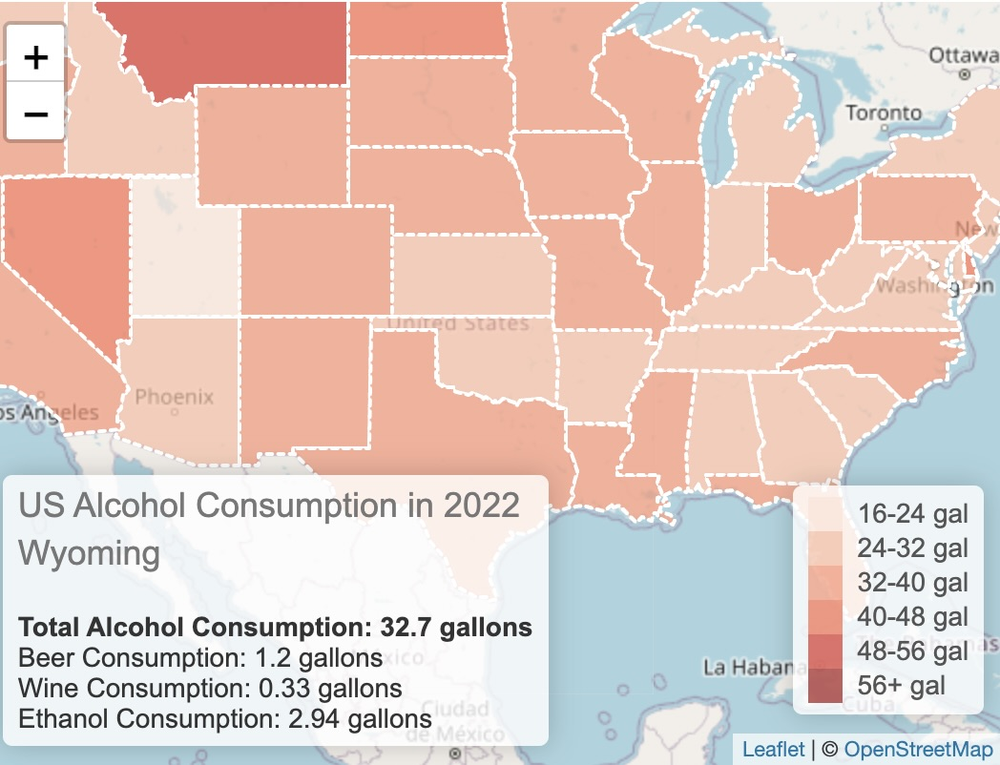
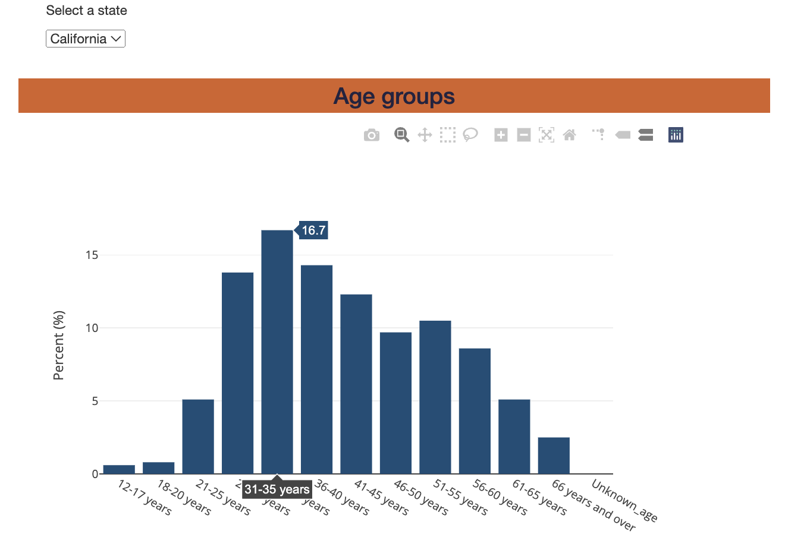
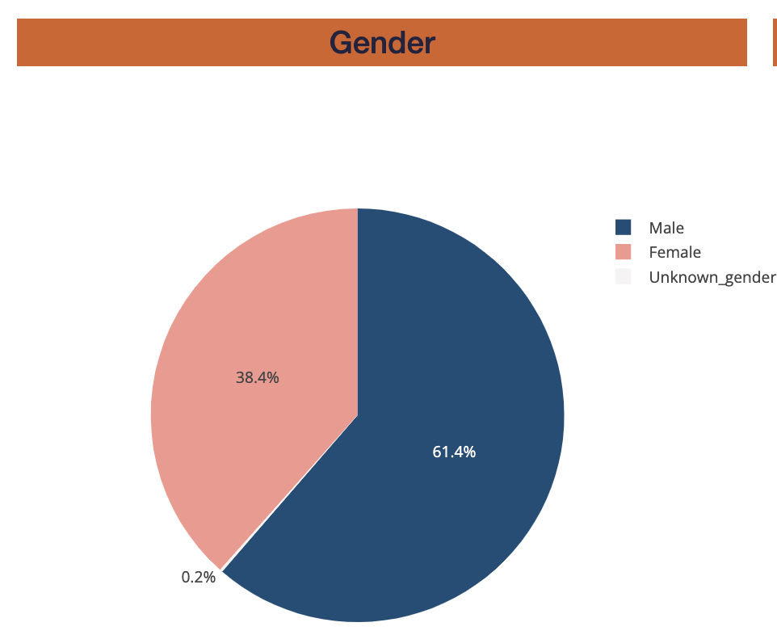
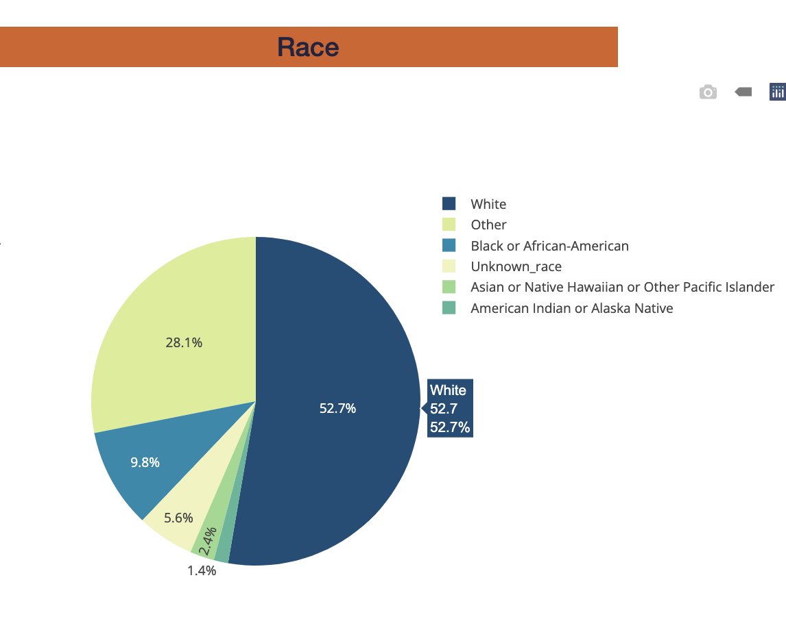
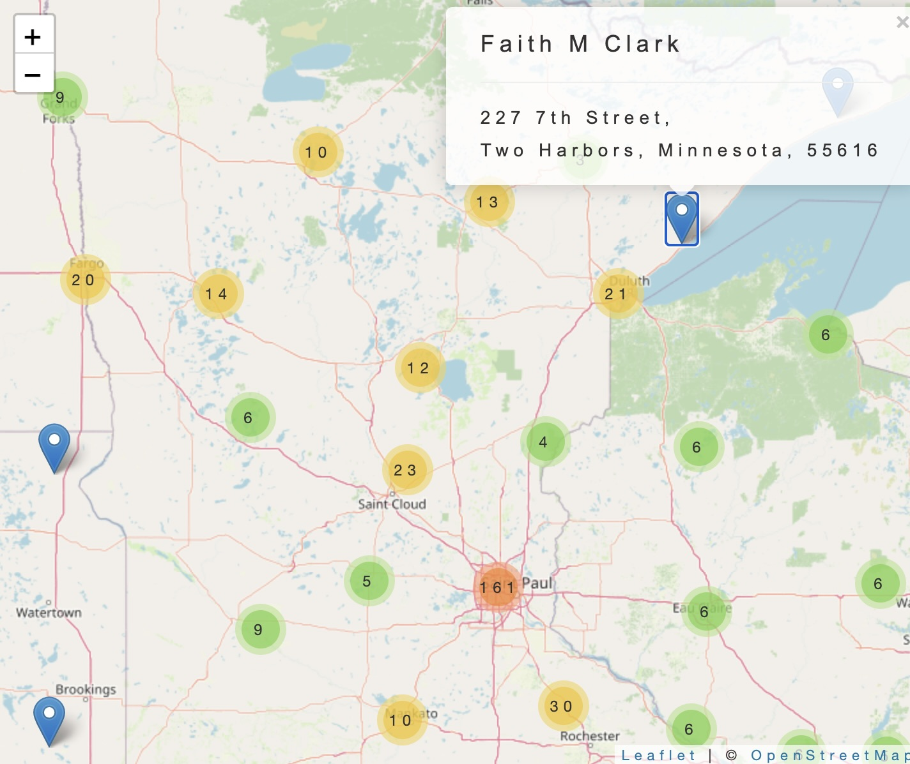

# Project-3

### Overview
In 2022, it was found that around 63% of Americans regularly engage in drinking alcohol, be it socially or otherwise. In our project, we wanted to dig deeper into:
- How much alcohol Americans consumed in 2022.
- The adverse effects of alcohol, and how many people have died due to alcohol-related causes.
- How many medical facilities per state are available to assist with alcohol addiction.

Tech stack: Python, MongoDB, Flask, HTML, CSS, JavaScript (Leaflet, Bootstrap, D3)

### Team Members 
Fiza, Mimi, Nivetha, Katherine, Shipra

### Questions
1) What are the top states with highest alcohol consumption per capita?
2) What are the top states with highest alcohol-related fatalities?
3) Distribution of alcohol consumption type by state.
4) Which demographics are most affected by alcohol-related deaths in the highest 3 states?
5) Are there sufficient rehabilitation resources in areas where alcohol-related deaths are prevalent, example California?
6) Is there a relationship between the amount of alcohol consumption per capita and the amount of available resources for alcoholism?

### Data and Delivery
Once we gathered our data sources, we looked at the information holistically and isolated our facility research to 3 states for a smaller sample size.

- Our data was procured through a range of CSVs and Web Scraping, focusing on public health data around alcohol consumption in the US in 2022. We extracted and transformed this data into readable JSON’s.

- We decided to use Mongo DB to store our data, as the information we collected was mostly suited for a non-relational database.
  
- Our site is hosted on Flask. The primary elements that we considered were,
  - Our home page would house our HTML code and in turn our main Javascript code.
  - There would be API endpoints available to our users curious about our data.

### Back End
- We incorporated map objects to visualize the data pertaining to alcohol consumption & rehabilitation facilities (clustermarker map). We procured a geojson for state coordinates. 

- We created a dashboard by webscraping to accumulate the data and combined with other extraction methods. 

### Visualizations
We created 4 unique visualizations in the dashboard utilizing D3, Plotly, Leaflet and Bootstrap. 

- Alcohol consumption interactive GeoJSON map has zoom in feature and display information on alcohol consumption per capita based user selection of states. It shows the highest and lowest consumption based on the color gradient in the legend section.

- Alcohol fatalities has features like drop-down for selection of states, zoom in and out to maximize or minimize the information on the plot and hover-over display of demographic information including age groups, gender and race distribution.

  
- Rehab facilities has interactive cluster marker map which has zoom in feature and hover-over feature to highlight the area and click on for selection of markers to display the number of alcohol rehabilitation facilities per capita. By zoom in further and clicking on specific cluster marker, user can find information on a particular rehabilitation facility in the area.

### Our findings
1) Montana, New Hampshire and Vermont were found to be the states with highest consumption per capita. Based on more research, these states had low index in population diversity and were the top 10 states with lowest population per capita. 

2) We found out the top 3 states with the highest alcohol related deaths per population were California, Florida and Texas. These states had high population and high diversity index. So, we explored the demographics of these states.
   
3) We found information on beer, wine and ethanol consumption per state. Ethanol consumption represented the highest type of consumption in the top 3 states including Montana, New Hampshire and Vermont.

4) We observed a common pattern in these 3 states. Age group within 26-60 years old represented the highest death rate and more than 60% were white male population. We also observed Texas white population experienced 85% of the death rate due to excess alcohol consumption.

5) No, there are not enough rehabilitation resources in areas where alcohol-related deaths are prevalent to support the population demand. For example: California representing the highest number of deaths, are among the fifteen states with the lowest number of rehab facilities per capita. Texas in particular has the least number of facilities per capita in the United States.

6) We observed a relationship between the amount of alcohol consumption per capita and the amount of available resources for alcoholism. Montana is one of the top 3 states with the highest alcohol consumption rate per capita, and is also one of the top three states with the highest number of facilities per capita. New Hampshire ranks 19th, and Vermont is ranked 9th with the highest number of facilities per capita. California, Florida, and Texas are among the 15 states with the lowest number of rehabilitation facilities per capita despite having a high population as well as high alcohol related fatality rate.

### Future direction
In our initial research, we found a javascript library called “Algolia Places” but were unable to spend enough time to integrate it. It would enhance user's search for better experience. Using GeoSearch, Algolia Places can create a search bar on our website that would help struggling alcohol addicts to look for rehabilitation facilities in their neighborhood. 

### Data Sets - (focus on 2022 year)
1) [Alcohol consumption](https://wisevoter.com/state-rankings/alcohol-consumption-by-state/)
2) [US States GeoJSON](https://www.kaggle.com/datasets/pompelmo/usa-states-geojson)
3) [SAMHSA Alcohol Fatalities](https://www.samhsa.gov/data/quick-statistics-results?qs_type=teds&state=California&year=2022&type=Admissions&view=full)
4) [SAMHSA Alcohol Rehab Facilities](https://www.samhsa.gov/data/report/national-directory-of-drug-and-alcohol-abuse-treatment-facilities)
5) [Population per state](https://www.statista.com/statistics/183497/population-in-the-federal-states-of-the-us/) This was used for per capita research. 

### References
1) States with highest alcohol consumption per population:  https://www.bankrate.com/insurance/car/drunk-driving/#stats-2022   https://drugabusestatistics.org/alcohol-related-deaths/

